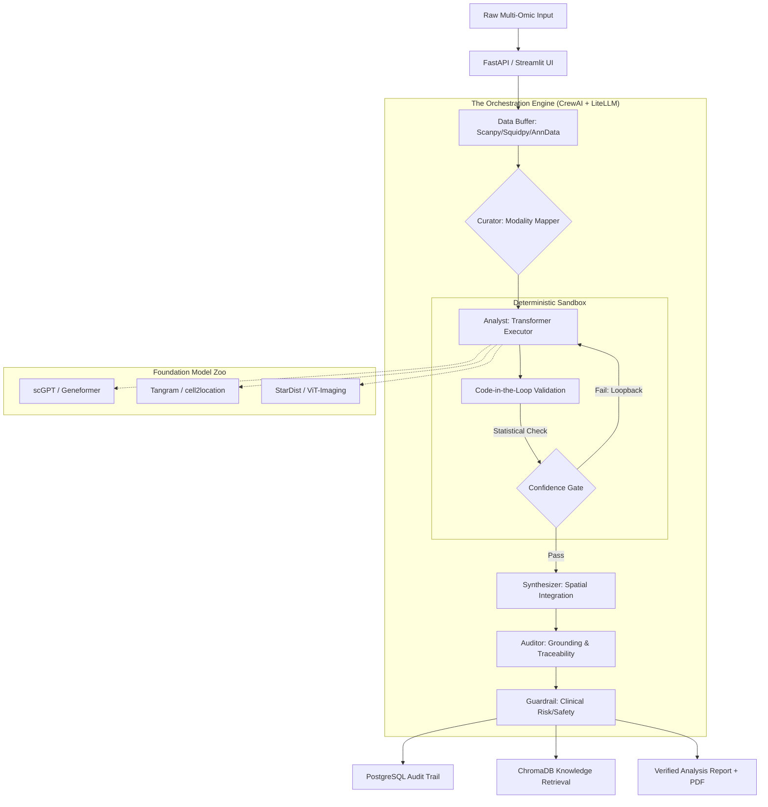

# SpatioCore Flow v2.0 — Gated Multi-Agent Biological Orchestrator

SpatioCore Flow is a production-grade, multi-agent framework for autonomous analysis of **Single-Cell Genomics (SCG)** and **Spatial Transcriptomics (ST)**.

Unlike standard LLM wrappers, SpatioCore Flow implements a **Verification-First architecture**. Foundation models (scGPT, Geneformer) and spatial tools (Tangram, cell2location) operate as modular worker nodes governed by **Deterministic Validation Gates** to eliminate biological hallucination.

---

# 1. Advanced System Architecture

SpatioCore Flow v2.0 utilizes a **Hybrid DAG Orchestration model**.

It replaces linear agent chaining with a **Sandbox-Gate pattern**: every AI-generated inference is programmatically verified against raw AnnData/Squidpy objects before downstream propagation.



---

# 2. The Gated Agent Pipeline

Each agent is constrained by **Pydantic output schemas** to enforce structured data integrity.

| Tier | Agent | Logic Type | Role in the Flow |
|------|-------|------------|------------------|
| 1 | Curator | Deterministic + LLM | Maps raw data to correct biological coordinate system (Dissociated vs. In-Situ). |
| 2 | Analyst | Tool-Execution | Runs foundation models for deconvolution and ST prediction. |
| 3 | Validator (NEW) | Code-Driven | Verifies Analyst claims (e.g., marker genes exist in source data). |
| 4 | Synthesizer | Reasoning | Merges “What” (RNA) with “Where” (Spatial). |
| 5 | Auditor | Verification | Provides source-to-bit traceability linking every claim to gene index or pixel coordinate. |
| 6 | Guardrail | Compliance | Evaluates outputs against FDA/SaMD risk frameworks and clinical literature. |

---

# 3. Core Technical Decisions

## Code-in-the-Loop (CitL) Verification

To mitigate agentic hallucination:

- Auditor triggers secure Python sandbox execution
- Biological Consistency Score (BCS) is computed
- If BCS < 0.8 → inference rejected
- Analyst re-runs with constraint adjustments

---

## Multimodal "Digital Twin" Synthesis

- Tangram + cell2location map dissociated profiles onto tissue slices
- Synthesizer builds a **Spatial Graph** of the tumor microenvironment (TME)
- Predicts drug penetration and spatial efficacy

---

## Traceability & Explainability

- All outputs timestamped and stored in PostgreSQL
- Deep Linking: clicking a recommendation highlights spatial spots that generated it
- Every biological claim linked to raw data index

---

# 4. Production Roadmap & Testing

## Testing Strategy

**Regression Testing**
- Tabula Sapiens (Single-Cell)
- 10x Visium (Spatial)

**Synthetic Hallucination Testing**
- Inject scrambled genomic inputs
- Ensure Confidence Gate blocks invalid inference

---

## Scalability Plan

**Model Sharding**
- scGPT and large models deployed as independent microservices

**Asynchronous Execution**
- Heavy spatial tasks run as background jobs
- UI updated via WebSocket state manager

---

# 5. Tech Stack

| Layer | Technology |
|--------|------------|
| Orchestration | CrewAI (Hybrid-DAG), LiteLLM |
| Omics Compute | Scanpy, Squidpy, AnnData |
| AI Models | scGPT, Geneformer, StarDist, ViT |
| Database | PostgreSQL (State), ChromaDB (RAG), Redis (Cache) |
| Validation | Pydantic (Schemas), Pytest (Regression) |
| API Layer | FastAPI + Streamlit UI |

---

# 6. Installation

## 1. Environment Setup

```bash
# Recommended: use 'uv' for high-speed dependency resolution
uv venv
source .venv/bin/activate
uv pip install -r requirements.txt
```

---

## 2. Launching the Flow

```bash
# Launch CLI + Streamlit UI
python main.py --ui
```

---

# Disclaimer

SpatioCore Flow is a research prototype intended for professional bioinformaticians.

It does **not** provide medical advice.

All outputs must be verified by a qualified investigator.

The system is designed to align with FDA SaMD (Software as a Medical Device) transparency and traceability principles but is not currently a certified medical device.

---

# License

MIT License
