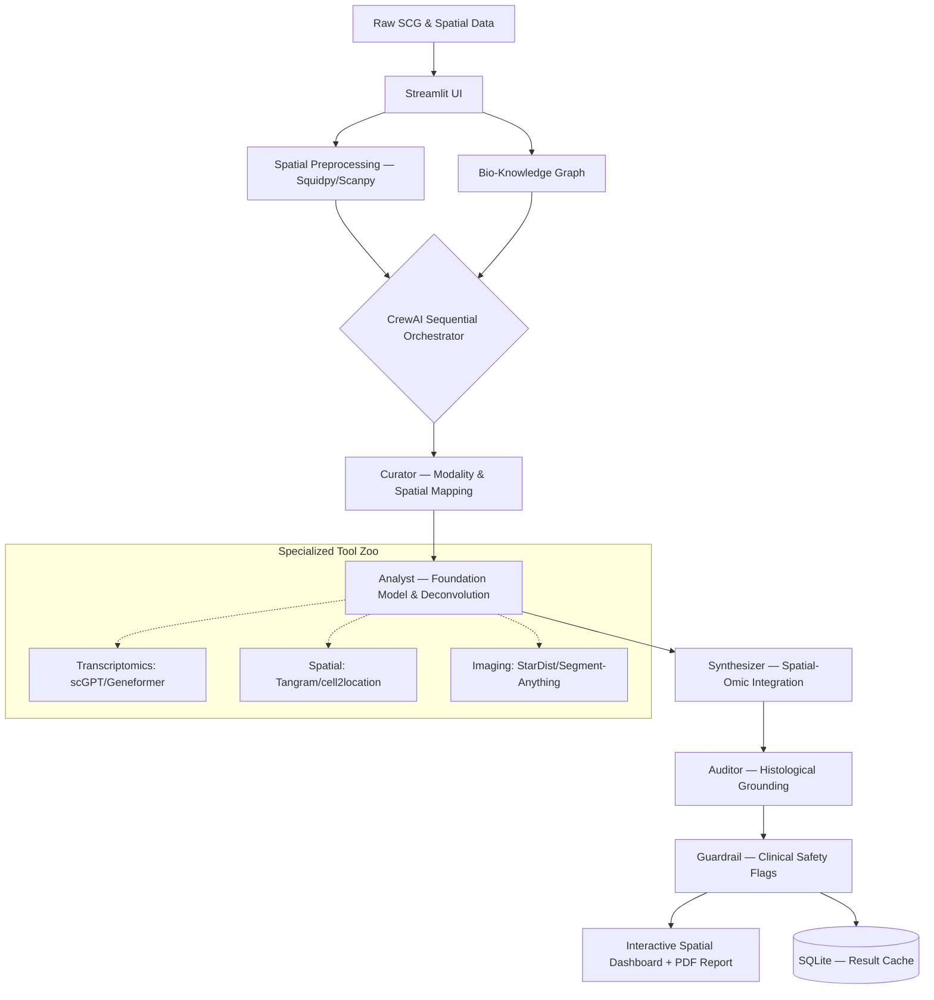

# SpatioCore Flow — Verification-First Multi-Agent LLM Architecture

SpatioCore Flow is a sequential multi-agent system designed to bridge the gap between Single-Cell Foundation Models and clinical decision support.

It orchestrates a suite of specialized transformers—including scGPT, Geneformer, and HyenaDNA—to automate high-dimensional biological analysis with an autonomous, audit-ready verification layer.

It is a research prototype exploring how agentic workflows can navigate the complexity of multimodal single-cell genomics (SCG) and spatial biology.

---

## System Architecture

SpatioCore Flow operationalizes a **Multimodal Modality-to-Task pipeline**.

It treats pre-trained biological transformers and spatial deconvolution tools as modular **"Tools"** within a CrewAI framework.

The orchestrator determines whether to invoke:
- Single-cell models (scGPT, Geneformer)
- Spatial models (Tangram, cell2location)
- Imaging transformers (StarDist, Vision Transformers)

Based on:
- Input modality
- Downstream biological task

---

## Architecture Diagram



---

## Agent Pipeline

| Tier | Agent        | Logic Type   | Primary Responsibility |
|------|-------------|--------------|------------------------|
| 1 | Curator | Fast | Maps raw inputs to physical context; identifies whether a sample is Dissociated (Single-Cell) or In Situ (Spatial). |
| 2 | Analyst | Tool-Bound | Executes tasks: cell-type deconvolution, spatial transcriptomics prediction, and morphological segmentation. |
| 3 | Synthesizer | Reasoning | Merges **"What" (Transcriptomics)** with **"Where" (Spatial)**; identifies cellular neighborhoods and ligand-receptor proximity. |
| 4 | Auditor | Precise | Verifies that predicted drug responses are feasible within the observed Tissue Microenvironment (TME). |
| 5 | Guardrail | Precise | Flags discrepancies between molecular signatures and histological features (e.g., misaligned tumor margins). |

---

## Design Decisions — Why “Flow”?

### 1. Beyond the "Soup"

Standard single-cell analysis treats tissue like a "soup," losing cellular coordinates.

By integrating:
- Spatial transformers
- Image transformers

SpatioCore Flow can determine whether:
- An immune cell is infiltrating a tumor  
- Or simply located at the periphery  

---

### 2. Histological Grounding

The Auditor agent treats spatial and imaging outputs as **ground truth anchors**.

If the Transcriptomics Analyst predicts:
- High metabolic activity  

The Auditor cross-references:
- Cell morphology  
- Tissue architecture  

To validate biological plausibility.

---

### 3. Deconvolution Logic

Spatial transcriptomics spots often contain multiple cells.

The Analyst agent uses deconvolution tools (e.g., Tangram) to:
- Map high-resolution single-cell profiles  
- Onto lower-resolution spatial captures  

---

## Tech Stack

| Layer | Technology |
|-------|------------|
| Agent Orchestration | CrewAI (Sequential Process) |
| Foundation Models | scGPT, Geneformer, scPathway, ESM-2 |
| Spatial Frameworks | Squidpy, Tangram, cell2location |
| Imaging & Vision | OpenSlide, StarDist, Vision Transformers (ViT) |
| Data Processing | Scanpy, PyTorch, Biopython |
| Inference Routing | LiteLLM (Groq, OpenAI, Anthropic support) |

---

## Installation & Usage

### 1. Configure Credentials

Create a `.env` file in the project root:

```bash
GROQ_API_KEY=your_key_here
OPENAI_API_KEY=your_key_here
```

---

### 2. Install Dependencies

```bash
pip install -r requirements.txt
```

---

### 3. Run the Platform

```bash
streamlit run app.py
```

---

## Disclaimer

SpatioCore Flow is a research prototype.

It does **not** provide medical advice and is **not validated for clinical use**.

All outputs require review by a qualified healthcare professional.

The regulatory risk assessment produced by the Guardrail agent is prompt-generated and does not constitute a legal or regulatory determination.

---

## License

MIT License
